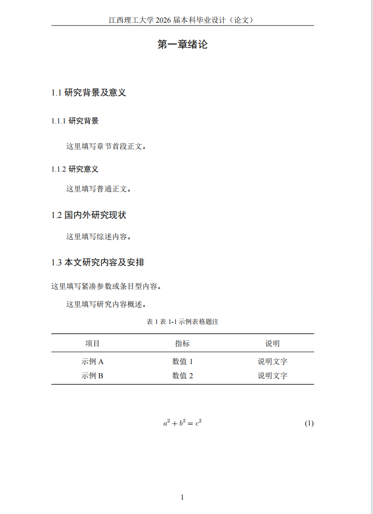

# JXUST LaTeX

江西理工大学本科毕业设计（论文）LaTeX 模板，基于学校 Word 版式整理而成。



## 项目结构

```text
JXUST-latex/
├── README.md
├── .gitignore
├── build.bat                        # 一键编译脚本
├── merge_cover.py                   # 封面转 PDF 并合并
├── jxust-setup.tex                  # 样式定义（导言区）
├── thesis_template.tex              # 论文主文件
├── 附件6.本科毕业设计（论文）封面和封底.doc
├── figures/                         # 图片资源
│   └── image2.png
└── output/                          # 编译输出（自动创建）
    ├── thesis_template.pdf          # 论文 PDF
    ├── 附件6...封面和封底.pdf        # 封面 PDF
    └── final_thesis.pdf             # 合并后的完整 PDF
```

## 模板特性

- 基于 `ctexart + XeLaTeX`，适配中文论文排版
- 正文、摘要、关键词、参考文献分别使用独立段落样式
- 摘要页码为罗马数字，正文从第一章起切换为阿拉伯数字
- 已启用 PDF 书签
- 表格默认使用 `booktabs` 三线表
- 自带公式、图片、表格示例

## 环境准备

### 1. 安装 TeX 发行版

二选一：

- **MiKTeX**（推荐，Windows 下更轻量）
- **TeX Live**

### 2. 安装编辑器

任选其一：

- VS Code + LaTeX Workshop 插件（推荐，适合持续维护）
- TeXstudio
- WinEdt

### 3. 确认系统字体

本模板依赖以下字体，Windows 一般已预装：

- SimSun（宋体）、SimHei（黑体）
- Times New Roman、Courier New

### 4. 配置 PATH

将 MiKTeX 的 `miktex\bin\x64` 目录加入系统 `PATH`，终端执行以下命令验证：

```powershell
xelatex --version
```

## 编译方法

### 方法一：一键编译（推荐）

双击 `build.bat`，或在终端运行：

```powershell
.\build.bat
```

脚本会依次完成：

1. 用 XeLaTeX 编译论文两遍
2. 将编译产物移入 `output/` 目录，清理中间文件
3. 通过 Word 将封面封底 `.doc` 转为 PDF
4. 用 `pdfunite` 将封面 PDF 合并到论文 PDF 前面，生成 `final_thesis.pdf`

最终在 `output/` 下得到完整论文。

### 方法二：手动编译

如果只需要编译论文本体（不含封面合并），在终端运行：

```powershell
xelatex -interaction=nonstopmode -halt-on-error thesis_template.tex
xelatex -interaction=nonstopmode -halt-on-error thesis_template.tex
```

编译两遍可确保目录、书签、交叉引用稳定。

### 依赖说明

封面合并功能需要：

- **Microsoft Word**（通过 `win32com` 调用，用于 `.doc` 转 PDF）
- **pdfunite**（MiKTeX 自带，用于合并 PDF）

如未安装 Word，`build.bat` 会跳过封面合并，仅输出论文本体。

## 使用指南

1. 打开 `thesis_template.tex`
2. 按章节替换占位内容
3. 将图片放入 `figures/`，在 `.tex` 中引用
4. 运行 `build.bat` 编译

## 常见修改位置

| 修改内容 | 所在文件 | 对应命令 |
|---------|---------|---------|
| 页眉文字 | `jxust-setup.tex` | `\fancyhead[C]{...}` |
| 页边距 | `jxust-setup.tex` | `\geometry{...}` |
| 标题样式 | `jxust-setup.tex` | `\chaptertitle`、`\sectiontitle`、`\subsectiontitle` |
| 摘要/正文/参考文献格式 | `jxust-setup.tex` | `\cnabstractpara`、`\bodypara`、`\referenceentry` |
| 图表题注样式 | `jxust-setup.tex` | `\captionsetup{...}` |
| 图片替换 | `thesis_template.tex` | `\includegraphics{...}` |
| 封面文件替换 | 项目根目录 | `附件6.本科毕业设计（论文）封面和封底.doc` |
